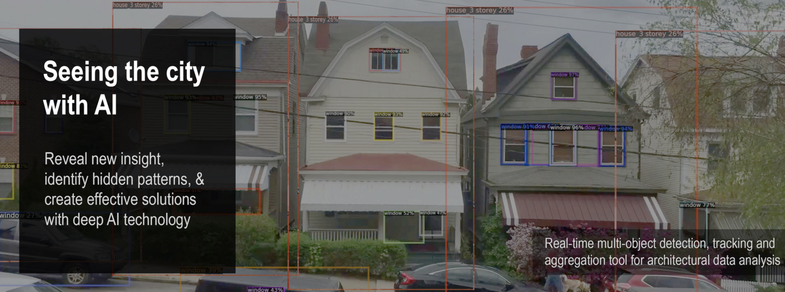

# Archi_Vision




## About 

Archi_Vision is an AI tool that helps us learn more about urban housing and its relationship to the city.  Traditionally, housing data has been collected manually and contains few descriptors beyond house price, sqft, # of bathrooms,and so on.  As a result, housing remains largely undescribed and our understanding of its relationship to the city incomplete. Archi_Vision attempts to solve this by using Deep learning methods (object detection & classification) to rapidly extract far more detailed image-based housing data over larger areas than previously possible.

As proof of concept, I used Pittsburgh as a test area and trained my models on 750 hand-collected and labelled Google Street view images of working-class housing.  A a goal my project attempts to autonomously detect, analyze and record both standard visual housing data as well as new and novel info such as early signs of urban decline or gentrification including the presence or lack of abandoned buildings and the quality of sidewalks. Various concepts from class such as “Interpretability” and “Bias and Anonymity” were integrated.  


## GUI

The proposed GUI provides further ai transparency through white-box methods such as prediction and data visualizations and simple explanations, required human input to correct model prediction mistakes or uncertainties therefore building trust in the model, both baseline and expert model adjustment capabilities, therefore staisfying the needs of users with varying ai or cs knowledge, and easy to understand prompts and suggestions regarding determining the appropriate model and settings to satisfy particular goals.


# Models

### Summary:  
4 different models were used for this experiment. 

### Model 1: Untrained Image Classification Model

```
python "Vacancy_Image_Classification_Training_Model.ipynb"
```

- A single label classification model used to train a convolutional neural network algorithm 
  to detect whether a house appears to be occupied or vacant.
- The model is built upon the fastai framework and pytorch (pyimage) computer vision library
- Model is trained on aprox. 200 hand selected images of working class houses from Pittsburgh that 
- have been manually sorted based on occupancy (occupied or vacant)
- This code was learned and adapted from various tutorials for and methods suggested by Fastai, an
online platfor that makes building, using and manipulating deep learning algorithms easier and
more accessible to cs and deep learning beginners.
- https://docs.fast.ai/tutorial.vision.html#Single-label-classification

#### Code modification and additions

- Though this tutorial was followed, various significant modifications and additions to thecode           
  were neccessary to achieve the goals of this project. they include: 
- setting up general framework of model and file structure
- modification of image transormation variables prior to training
- modification of batch size and image scale dependent on need and available computing power
- modification of learner rates after a series of experimentation with various learning rates
- learner rate of between le-4 and le-2 were found to be most suitable to achieve highest accuracy 
  and lowest loss function
- model results and confusion rates helped to provide further guidance to finely tune image 
  transformations, batch sizes and learning rate
  to achieve best results.

 
 
### Model 2: Trained Image Classification Model for Identifying Vacant Houses

```
python "Vacancy_Image_Classification_Prediction_Model.ipynb"
```


<br clear="right"/>

- A single label classification model that uses the weights obtained in training model (model 1) 
  to detect whether a house appears to be occupied or vacant.
- The model also labels and sorts images into folders with corresponding names.
- The model is built upon the fastai framework and pytorch (pyimage) computer vision library
- This code was learned and adapted from various tutorials for and methods suggested by Fastai, an
online platform that makes building, using and manipulating deep learning algorithms easier and
more accessible to cs and deep learning beginners.
- https://docs.fast.ai/tutorial.vision.html#Single-label-classification

#### Code modification and additions

- Though this tutorial was followed, various significant modifications and additions to thecode           
  were neccessary to achieve the goals of this project. they include: 
- setting up general framework of model and file structure
- loading and using custom trained weights from previous training model (model 1)
- custom labelling and sorting tool that provides corresponding file and folder labels 
  depending on predicted class.
- This allows easy identification of predicted class of all images after model has run
   
  
  
### Model 3: Trained Object Detection Model for Identifying Architectural Features

```
python "Arch_Features_object_detection.ipynb"
```

- This model uses Objectron 2, Facebook AI Research's next generation software system 
  that implements state-of-the-art object detection algorithms to detect and predict the type of
  architectural features (either door, window or general building volume) are present in images 
  and videos of working class houses in Pittsburgh.
- torchvision 1.7.0. used for computer vision library
- @misc{wu2019detectron2,
  author =       {Yuxin Wu and Alexander Kirillov and Francisco Massa and
                    Wan-Yen Lo and Ross Girshick},
    title =        {Detectron2},
    howpublished = {\url{https://github.com/facebookresearch/detectron2}},
    year =         {2019}
-  Model is trained on images that were manually collected from Google Street 
   View and labelled manually on sixGill, an online platform that simplifies AI
   deployment and contains rapid image dataset labelling tools
-  https://sixgill.com/
-  These trained images are located within the github repository within the data folder
- The included code was learned and adapted from various tutorials and sources including
   1. The official Detectron 2 Tutorial:
      https://colab.research.google.com/drive/16jcaJoc6bCFAQ96jDe2HwtXj7BMD_-m5
   2. Sage Elliot: my friend and research partner who has collaborated with me on a few 
      different AI deep learning projects.  He provided the bulk of the below code and a great deal 
      of guidance and advice when learning how to run, impliment and adapt the below 
      objectron 2 code for this project.

#### Code modification and additions

- Though much of the code was provided by the facebook tutorial and Sage, various significant 
  modifications  and additions to thecode were neccessary to achieve the goals of this project. 
  they include: 
- setting up general framework of model and file structure
- hand collecting aprox. 200 images from Google street view and labelling over aprox. 500 individual objects
  to be used for the training dataset.
- custom modifications to solver max iteration, model weight type appropriate for Coco detection 
  & faster rcnn convolutional model, batch size, number of object detection classes, and score
  threshold size when determining which prediction certainty rate (as shown in percentage) should 
  be used when making predictions and displaying results on image.
          
   
   
### Model 4: Trained Object Detection Model for Identifying Deteriorating Sidewalks

```
python "Sidewalks_Detectron2_object_detection.ipynb"
```
        
- This model uses Objectron 2, Facebook AI Research's next generation software system 
  that implements state-of-the-art object detection algorithms to predict and classify sidwalk quality
  in images of residential streets around Pittsburgh.
- torchvision 1.7.0. used for computer vision library
- @misc{wu2019detectron2,
  author =       {Yuxin Wu and Alexander Kirillov and Francisco Massa and
                    Wan-Yen Lo and Ross Girshick},
    title =        {Detectron2},
    howpublished = {\url{https://github.com/facebookresearch/detectron2}},
    year =         {2019}
-  Model is trained on images that were manually collected from Google Street 
   View and labelled manually on sixGill, an online platform that simplifies AI
   deployment and contains rapid image dataset labelling tools
-  https://sixgill.com/
-  These trained images are located within the github repository within the data folder
- The included code was learned and adapted from various tutorials and sources including
   1. The official Detectron 2 Tutorial:
      https://colab.research.google.com/drive/16jcaJoc6bCFAQ96jDe2HwtXj7BMD_-m5
   2. Sage Elliot: my friend and research partner who has collaborated with me on a few 
      different AI deep learning projects.  He provided the bulk of the below code and a great deal 
      of guidance and advice when learning how to run, impliment and adapt the below 
      objectron 2 code for this project.

#### Code modification and additions

- Though much of the code was provided by the facebook tutorial and Sage, various significant 
  modifications  and additions to thecode were neccessary to achieve the goals of this project. 
  they include: 
- setting up general framework of model and file structure
- hand collecting aprox. 200 images from Google street view and labelling over aprox. 500 individual objects
  to be used for the training dataset.
- custom modifications to solver max iteration, model weight type appropriate for Coco detection 
  & faster rcnn convolutional model, batch size, number of object detection classes, and score
  threshold size when determining which prediction certainty rate (as shown in percentage) should 
  be used when making predictions and displaying results on image.
   


## Data

#### Training Dataset 1 - Vacant vs Occupied Housing Images
- 200 images in total (100 vacant, 100 occupied) of working class houses in Pittsburgh, PA.
- Hand collected from Google street view 
- manually labelled and sorted into corresponding folders 

#### Training Dataset 2 - Architectural Features
- 197 images of working class houses in Pittsburgh, PA.
- hand collected from Google street view 
- hand labelled on SixGill platform
        
#### Training Dataset 3 - Sidewalk Quality
- 104 images of various quality level sidewalks in Pittsburgh, PA.
- hand collected from Google street view
- hand labelled using image segmentation on SixGill platform
        
        
        * Data available upon request
